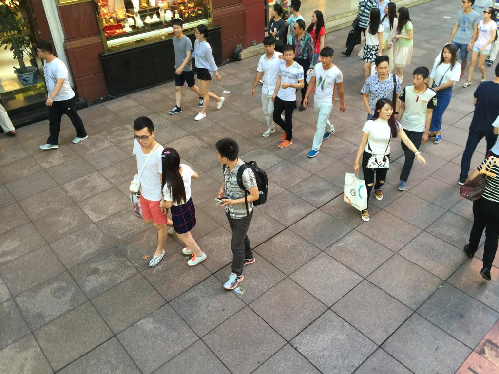
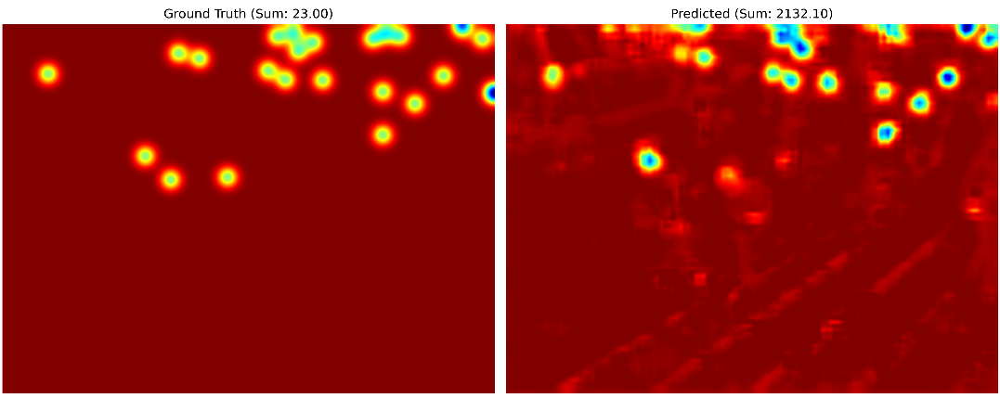

# Effective Crowd Counting Using Deep Learning Networks
Honours Thesis

## Crowd Counting
### Task Description
Crowd counting is a key research direction in the field of machine perception.[1](https://arxiv.org/abs/2407.19491) Crowd counting is not just about counting people; it can also involve identifying any specific objects in images or videos. To conduct comprehensive scene analysis, understanding the distribution of objects across multiple categories is crucial, which has significantly sparked interest in object counting research. It can be said that the core objective of crowd counting technology is to accurately estimate the number of specific objects in natural scenes.[2](https://arxiv.org/abs/2403.05435) Crowd counting is primarily achieved through two approaches: one is direct object counting, where the total number of people in the image is directly output as a numerical result after inputting the image. The other is the density map estimation method, which also takes the image as input but outputs a density distribution map of the crowd. By integrating the density map, the total count is ultimately obtained.[3](https://link.springer.com/article/10.1007/s11554-023-01286-8)

## Project Description
This project references the implementation of [MobileCount](https://github.com/ChenyuGAO-CS/MobileCount) and modifies upon it.
MobileCount builds upon the C³ framework, optimizing and lightening the model for mobile devices and resource-constrained environments.
### Introduction to C^3 Framework
The C³ framework is a high-performance encoder-decoder framework designed for real-time crowd counting.
#### Core Features:
1. **Robust Baseline Models**
2. **Convenient Development Toolkit**
3. **Powerful Logging Features**

#### Baseline Models:
1. **AlexNet**: The padding of the conv1 and conv2 layers was slightly modified to ensure that they can be properly divided by the size of the feature map. At the same time, the network before conv5 was intercepted as the encoder for crowd counting, and its size was 1/16 of the original input. The design of the decoder follows the principle of simplicity, using "two layers of convolution + upsampling" to directly regress to the 1-channel density map.

2. **VGG**: The original VGG and VGG+decoder with a simple decoding module. The encoder uses the first 10 convolutional layers of the VGG-16 model. VGG uses the simplest decoder, and VGG+decoder contains a simple three-layer deconvolution module.

3. **ResNet**: The stride size of the first layer of res.layer3 was changed from 2 to 1 to ensure that the feature map size is not less than 1/8 of the original image. The encoder output features are decoded through two layers of convolution, following the principle of simplicity.

| Model    | Features                                                                | Differences                                                                                       |
|----------|-------------------------------------------------------------------------|---------------------------------------------------------------------------------------------------|
| AlexNet  | - Introduced ReLU activation.                                           | High computational cost with many parameters.                                                     |
|          | - Used Dropout to mitigate overfitting.                                 |                                                                                                   |
|          | - Overlapping max-pooling layers.                                       |                                                                                                   |
|          | - Proposed data augmentation techniques.                                |                                                                                                   |
| VGG      | - Used small 3x3 convolutional kernels to increase depth.               | Unified use of small kernels (3x3).                                                               |
|          | - Repeated convolution and pooling blocks.                              | Increased depth for better performance but led to a larger parameter size.                        |
|          | - Standardized architecture.                                            |                                                                                                   |
| ResNet   | - Introduced residual blocks.                                           | Residual structure as a key innovation, allowing information to pass through without loss.        |
|          | - Added skip connections to address gradient vanishing issues.          | Solving training issues in deep networks.                                                         |
|          | - Enabled extremely deep networks.                                      |                                                                                                   |

### Improvements in the MobileCount Model:

1. **Incorporating MobileNet Design Principles**
   
3. **Simplified Model Architecture**

4. **Refined Multi-Scale Feature Fusion**
   
5. **Dropout Regularization**

## Result
| Statistical Method | Original                       | With Improvement          |
|--------------------|--------------------------------|---------------------------|
| Best MAE           | 19.22                          | 16.08                     |
| Best RMSE          | 28.33                          | 25.89                     |





## Deploy Project
```bash
git clone https://github.com/raymondstfx/Thesis.git
```

### Virtual Environment
**Python Version:** 3.10.11

Install [pyenv-win](https://github.com/pyenv-win/pyenv-win) first, then create a new virtual environment:
```bash
python -m venv .venv
```
Activate:
```bash
.\.venv\Scripts\Activate
```

### Cuda (Using GeForce GTX 1080 Ti)
```bash
pip install torch==1.12.0+cu113 torchvision==0.13.0+cu113 -f https://download.pytorch.org/whl/torch_stable.html
```

### Dependencies
Update setuptools:
```bash
pip install --upgrade setuptools
```
Install dependencies:
```bash
pip install contourpy==1.3.1 cycler==0.12.1 fonttools==4.55.3 h5py==3.12.1 kiwisolver==1.4.8 matplotlib==3.10.0 numpy==1.26.4 opencv-python==4.10.0.84 packaging==24.2 pyparsing==3.2.1 python-dateutil==2.9.0.post0 six==1.17.0
```
## Pretrained model
**ShanghaiA**

**ShanghaiB**

**UCF_QNRF:** [download](https://www.crcv.ucf.edu/data/ucf-qnrf/)

A prepared collection is ready for download on [Baidu Netdisk](https://pan.baidu.com/s/1g2-w97B7YuqOHCR2dNBunw). Password: vb4n 

## Run
First, training is performed, and then a weight file (i.e., a .pth file) will be generated:
```bash
python train.py
```

To generate a density map, run:
```bash
python visual.py
```
It will be generated in the `Visual` folder.
